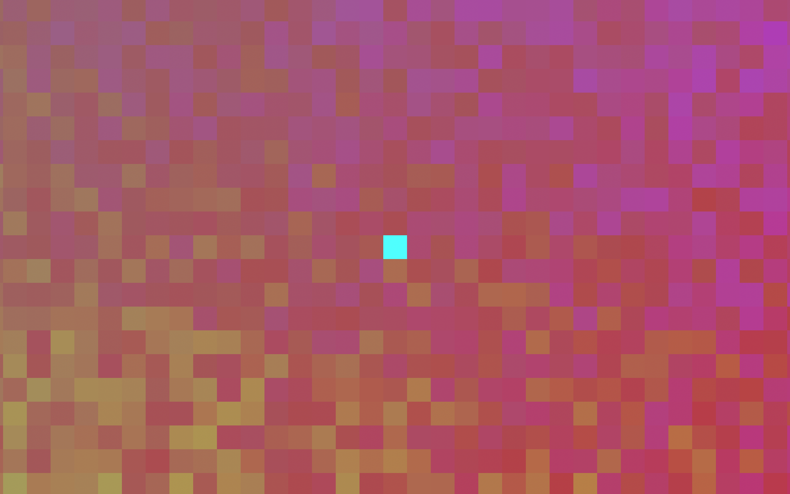
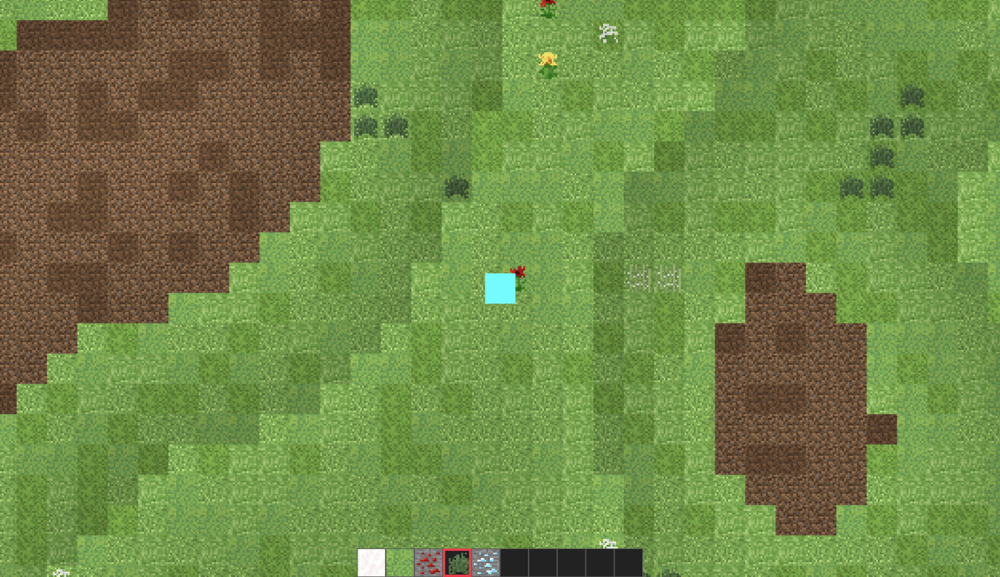

# Project 4: Pixelland

## Group 5 - EECS 448

An HTML5 Canvas-based browser walking & building game.

[Video Demo](https://www.youtube.com/watch?v=3guzbg383WA)

[Live Demo](https://people.eecs.ku.edu/~m001p596/project/eecs-448-pixelland/eecs-448-project-3/)

[Description of the development process](https://max.patii.uk/projects/pixelland)

## Welcome to Pixelland:

Available Maps:

### Rainbowland

You are spawned in a middle of a blocky gradient with seemingly no task at hand
other than to wander around and ponder the mysteries of the universe.

### Minecraft

This sure feels like a Minecraft clone. Except, it has no mines or carts - just
2d sprites procedurally generated in every direction as far as eye can see.

Has a functional inventory system as well as item placing.

## Deployment and Documentation

See the docs in the [documentation directory](./documentation/)
