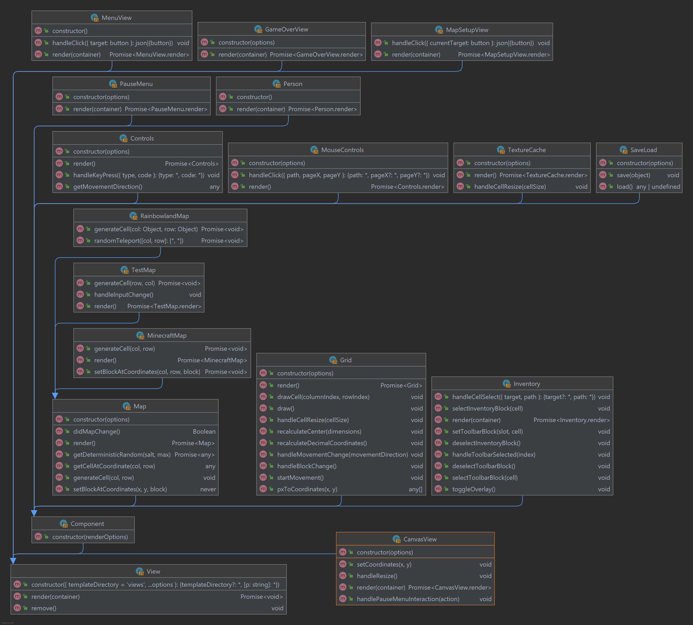

# Documentation

This is a general documentation for EECS 448 Pixelland game.

This guide contains information on getting the development and production server
up, as well as information about tools used in the process of development and
works cited.

## Time Estimate

[Time estimate](time-estimate.md) and
[actual accounting of time taken](time-accounting.md).

## Development

Clone this repository

```zsh
git clone https://github.com/maxxxxxdlp/eecs-448-pixelland
```

To start a development server, navigate to the inner `eecs-448-project-3`
directory and run this command to start a static server (assuming you have
python installed):

```zsh
python -m http.server 8000
```

Now, navigate to [http://localhost:8000](http://localhost:8000) and start
hacking away!

Special booleans DEBUG and DEVELOPMENT are set to true if they are provided in
the query string. These values are available in every file and can be used to
customize behaviour of views/components. Note, if DEBUG is enabled, DEVELOPMENT
is automatically enabled too.

Example usage:

- [http://localhost:8000/?debug](http://localhost:8000/?debug) (start the game
  in the debug mode)
- [http://localhost:8000/?development](http://localhost:8000/?development)
  (start the game in the development mode)

This would default to the `rainbowland` map. You can select a different map
though the `map` get parameter. For example:
`https://localhost:8080/?development&map=minecraft`

If you don't have python installed, you can use any one of
[these static web servers](https://gist.github.com/willurd/5720255)

### Testing Map Generation

A hidden "test" map is available for testing map generation.

Is is available at this URL:
[https://localhost:8080/?development&map=test](https://localhost:8080/?development&map=test)

It allows to adjust map generation parameters and see the result in real time.

### (Optional) Pre-commit hooks

This project uses pre-commit.com hooks, which run code linters and validators
before every commit. Instructions for configuring pre-commit hooks can be found
in [.pre-commit-config.yaml](../.pre-commit-config.yaml)

Besides, pre-commit, you would need to install development dependencies for all
hooks to work properly:

```zsh
npm i  # install development dependencies
```

## Production

Clone this repository

```zsh
git clone https://github.com/maxxxxxdlp/eecs-448-pixelland
```

Configure a reverse proxy (e.x Nginx) that would serve eecs-448-project-3 folder
on a public URL and handle the SSL certificate. Have players connect to the
public instance to play with each other.

## Documentation Generation

Documentation can be auto-generated with the tool
[Documentation.js](https://documentation.js.org/). To install documentation.js
globally using npm:

```zsh
npm install -g documentation
```

The generated documentation files will be found under `docs-gen` and are
compiled to html. This documentation framework follows JSDoc tags - all
supported tags and formatting can be found [here](https://jsdoc.app/) on JSDoc's
website.

To generate new documentation recursively for all files within the
`eecs-448-project-3` directory, start in the root of the repository and run:

```zsh
documentation build eecs-448-project-3/** -f html -o documentation/auto-docs-gen
```

Open `docs-gen/index.html` in your browser to view the static docs.

## Modeling Diagrams, Design Paradigms, Design Patterns, Prototype Architecture, and Requirements Artifacts

### Issue tracker

```
Use a defect tracking tool to manage software defects in your project
```

Fixed issues:
https://github.com/maxxxxxdlp/eecs-448-pixelland/issues?q=is%3Aissue+is%3Aclosed

Backlog of issues: https://github.com/maxxxxxdlp/eecs-448-pixelland/issues

### Design Pattern

For the third project we decided to follow a factory method style of design
pattern. The factory method design pattern consists of a parent class, known as
a superclass, and its subclasses, which allow for the alteration of types within
the objects created. This provided us with several advantages over some of the
other design patterns. First, the factory method is a flexible choice. It allows
us to create a superclass from which objects, or products, inherit certain
properties of the special factory method. This idea goes hand-in-hand with our
component-level design, as many of these objects require similar methods, in
spite of their varying types. For example, when creating entities such as allies
and foes, these objects may be different types, but down the chain-of-command
they inherit alike properties, and they each have access to the same methods as
one another. Second, for the continuation of project 3 into project 4, the
factory method is incredibly forgiving when expanding the scope of the codebase.
This was an important aspect of which design pattern we chose because we knew
beforehand we were going to have to make additions to many parts of our codebase
for the final part of the project. Returning later and adding additional types
of products is quite easy in this design pattern. Lastly, the factory method
provides us with some general quality-of-life features which were beneficial to
the process of creating our game. We had used this pattern previously when we
created Battleship, so it was something that we were all comfortable with. It is
also relatively easy to follow the superclass down to the furthest subclass in
the chain-of-command. Given the advantages that the factory method design
pattern provided us with, we felt like it was the most suitable for our needs.

### Design Paradigm

For the final project, we stayed consistent with our Javascript implementation
of Battleship and followed a **component-level** design paradigm. By definition,
component-level design is such that you create foundational building blocks for
the whole system - building blocks which are "portable, replaceable, and
reusable." While our game is written in a functional language (Javascript), we
follow this more abstract, component-based design model as it informs
extensibility for the future. The basic components of the game (ie, the game
grid, the player, the map, and the control mapping) are all clearly defined
along with the functionality and their relationships with one another. Down the
line, this clear, structured approach can enable us to alter or add on to the
functionality of specific components (add more maps, different keys, a two+
player mode, etc) without refactoring large sections of the code base.

Following the component-level design paradigm also gives us the freedom to
establish other layers of abstraction. Due to the nature of the game, we
designed it such that components would exist under the umbrella of certain "
views." If the game is just beginning, the user would be met with a Menu View
that makes connections to other neccessary components for that view, such as to
the Person component in a character selection screen. If the user is playing the
game, then the Canvas View would be rendered and would establish all of the
conections to components required for gameplay. Ultimately, the "views" are
simply components with our usecase/abstraction built in to their definition. In
following the component-level design paradigm, we can do what we consider to be
the most logical and fitting method of development for this video game.

### Prototype Architecture

As outlined above, using the component-level design paradigm informed the basic
client-server software architecture for our game. At its base, our game is
simply a web application. The client interacts with the web page using basic
inputs (mouse, keyboard), but it does not save the user's world and gameplay
data to any form of database server-side. It stricly adheres to a basic
client-server architecture, as outlined in the class lecture slides; that is,
the communication of the host server and the requesting clients happens over
HTTPS. Our project is hosted on Github, and as such Github Pages exists as our
web server. Anyone can access this server through a modern web browser and play
our game.

In a more granular sense, we can describe our game as following an MVC
architecture pattern. MVC stands for "Model-View-Controller," and as the name
would suggest, MVC-driven software is primarily built around models (in our
case, "components") which house core game functionality and logic. The views are
the front-end UI designs that enable user interaction with models - but this
user interaction cannot happen without a controller to mediate between the two
in a traditional MVC pattern. For our implementation, the views create and
handle any neccessary objects for that view, and ultimately destroy them. There
is no explicit controller to handle communication.

Overall, our software architecture follows standard MVC design patterns as would
be expected from a traditional web app, but it molded to fit our needs in making
a JavaScript-based video game. Furthermore, we neccessarily follow the
client-server architecture so that people can reach and play our game.

### Deployment Plan

As an indie game development studio, our primary goal is to have our game be 
accessible, while still turning a profit - a goal that is made easier by the fact that Pixelland was
written in Javascript. Our most obvious platform for deployment is on the web; we
could initially host the game on some of our team's own server hardware, then as the need arises and
cash-flow increases with popularity, it may become feasable to switch over to something more dynamic, 
like AWS instances. The aforementioned cash-flow would be based around a subscription, pay-for-access
model; paying a small monthly fee gives you access to all gameplay features, maps, and updates.
Overtime, this cash-flow helps pay our developers, cover hosting costs (including cloud storage 
for worlds), and enables the growth of Pixelland as a whole.

The creation of Pixelland was inspired by the notion of "undying imagination," and this 
philosophy just as well informs our approach to marketing Pixelland. We believe that it is a game
for all - enjoyment is there to be had regardless of age or aptness to playing video games - it is
a world to let your imagination run free. Being playable from a web brower means that it is relatively 
accessible, regardless of if you run Linux, MacOS, or Windows. The gameplay is straightforward and 
easy to grasp for anyone. Ultimately, all of these things mean that we have a large potential market
to work with; one that exists in a distinctly gray area. We cannot clearly define what our market is 
because our game is one that is not meant to appeal to any particular group of people. In having no clear, 
specific market pool, our marketing strategy is forced to be less concrete. Where and how we spend money on 
spreading word of our game is not clearly defined. As such, we would not be allocating much of our budget 
to large marketing campaigns; instead, we could generate hype through various social media platforms (ie, 
Reddit), and use that initial pool of customers as a jumping-off point. 

There will be other initial costs to supporting our game's launch: it was already described that we could 
avoid a high starting cost of hosting by using our own server hardware to support the people who initially 
want to pay-to-play Pixelland. Using rudimentary estimates of our game's popularity, we can gauge if it is 
necessary to also set up some elastic AWS instances alongside our own servers. Being cautiously prepared is
important, but also can be costly if not done right. Next, a domain (ie. PlayPixelland.net) would only 
represent a small fraction of cost. Google Domains offers that exact domain for just twelve dollars per 
year. Now, assuming we have money to spare after bearing the initial infrastructure costs, all that is left
to do is find people that want to play the game, or platforms on which we can spread the word. It would 
make sense to release Pixelland around the time that some indie game development conferences are happening -
this would enable our team to show off the game and garner support for its release. The associated costs 
to attending conventions, while non-trivial, is not as considerable as the cost of time spreading news of 
our newly releasing game to the public.

### Generated UML Diagram

We generated a UML diagram using
[a plugin](https://plugins.jetbrains.com/plugin/17380-uml-javascript-and-typescript)
for the JetBrains Ultimate IDE. The plugin generates class diagrams that follow
the latest EMCAScript 6 class standard. We have chosen to omit the field
descriptions for each class in order to maintain readability.


### Prototype Requirements

We've gone with a collection of features approach for our requirements, and they
can be found
[here](https://github.com/maxxxxxdlp/eecs-448-project-3/issues?q=is%3Aissue)

### Time Estimate

To aid in estimating our time-estimate, we loosely followed the Lines of Code
approach. We had a series of brainstorming meetings where we discussed plans for
our project, focusing on potential features. We talked about how difficult these
tasks would be, and estimated how long they would take based on their perceived
difficulty. This helped us create our general outline for our time estimate,
including how many lines of code each section may have. This organized our
outline, provided us with a time estimate, and helped us set priorities and
divide the work. We were also most comfortable with this method, and even though
it has some obvious disadvantages, such as unreliability, it still provided us
with a rough approximation of how long the project would take. Similar to how we
chose our design pattern, we had also previously used this method, and the
results had been satisfactory.

## Works Cited

### Code References

- The boilerplate for a starter project was copied from
  [here](https://github.com/maxxxxxdlp/max.patii.uk). Then, it was modified to
  remove dependency on Next.js, React and Tailwind.CSS
- Game board is rendered using table elements for the sake of accessibility, but
  it is styled as a grid, for the sake of convenience.
  [User-agent table styles reset](https://github.com/maxxxxxdlp/eecs-448-battleship/blob/main/eecs-448-battleship/components/Board/styles.css#L12)
  was copied from [here](https://stackoverflow.com/a/27851231/8584605) (with
  modifications)
- [Basic OOP implementation of MVC](https://github.com/maxxxxxdlp/eecs-448-battleship/blob/1c3ab08b1ac0621307e7af35c2ad064e9491836a/eecs-448-battleship/lib/js/view.js#L11)
  was inspired by [Backbone.js](https://backbonejs.org/) (except, we simplified
  and modernized it)
- String hashing algorithm copied from
  [here](https://stackoverflow.com/a/43383990/8584605).

### Documentation References

- Answered questions on JSDoc syntax:

  - https://stackoverflow.com/questions/46454372/grouping-functions-in-jsdoc-generated-documentation
  - https://stackoverflow.com/questions/19230971/how-do-i-jsdoc-a-nested-objects-methods
  - https://stackoverflow.com/questions/14611995/how-to-specify-an-array-of-objects-as-a-parameter-or-return-value-in-jsdoc
  - https://stackoverflow.com/questions/6460604/how-to-describe-object-arguments-in-jsdoc
  - https://stackoverflow.com/questions/28763257/jsdoc-return-object-structure
  - https://stackoverflow.com/questions/30058201/adding-static-files-to-jsdoc

- Bloomfield, Aaron. “PDR: Doxygen Tutorial.” PDR: Doxygen Tutorial,
  www.aaronbloomfield.github.io/pdr/tutorials/11-doxygen/index.html.
- “Fine-Tuning the Output.” Doxygen Manual: Doxygen Usage,
  www.doxygen.nl/manual/doxygen_usage.html.

- JSDocs Implementation Used: https://documentation.js.org/

- Tag reference: https://jsdoc.app/

## Tech stack

- JavaScript
- ESLint
- Prettier
- Stylelint

## Tools Used

Tools used in the process of development

- Git
- pre-commit.com
- GitHub
- Vim
- PyCharm
- Visual Studio CODE
- Documentation.js

## Licence

This code is available under MIT Licence
